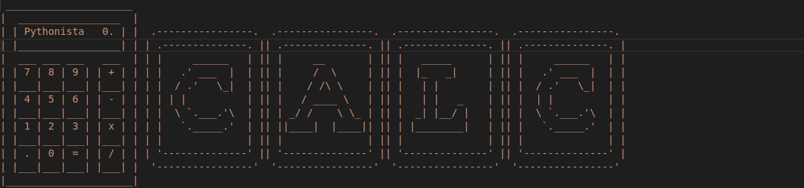

# Day10

## Lessons learned today

- Functions with outputs
```
def add(n1,n2):
    return n1 + n2
```
- Doc strings
```
def add(n1,n2):
    """ adds two inputs and returns their sum"""
    return n1 + n2
```

- Recursion
```
def calculate():
    print("do some math!!")
    calculate()
calculate()
```


## Project to solidify material learned: 

### Rock_Paper_Scissors

> simple basic calculator that can add, subtract, multiply and divide

#### Preview:



## How to run this on your device

- Clone this repository
```
git clone https://github.com/kingdreamerr/Day10_Calculator.git
```
- cd into the repo
```
cd Day10_Calculator
```

- Paste the following in the terminal 
```
python3 main.py
```